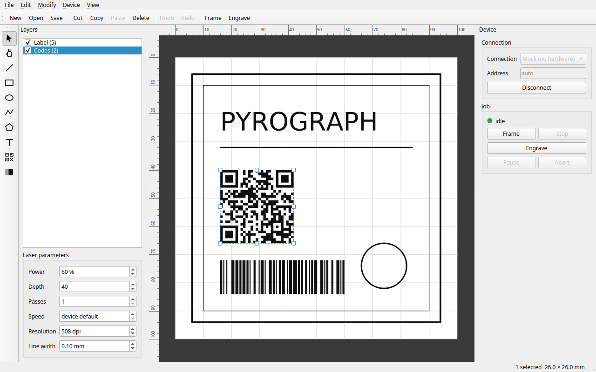

# PyroGraph

Laser engraving software for Linux, macOS and Windows. Draw a job, place it on the bed, burn it.

Built for the **LaserPecker 2** (firmware 3.16). The protocol is the same across LP1–LP5, and other
engravers can be added.



## Why

The vendor's desktop software is Windows and macOS only. On Linux there is nothing, so all you get is the
phone app, and that is a bad way to place a motif to the millimetre.

The second reason is privacy. Engraving happens over a cable, between a PC and a machine on the desk. That
does not need an account or an internet connection, and with a closed-source app you cannot check what it
does with your files. PyroGraph talks to the engraver and to nothing else — no telemetry, no update check,
no account. There is no HTTP library anywhere in the dependencies.

## What it does

- Draw lines, rectangles, ellipses, polylines and polygons
- Import SVG
- Place text, QR codes and barcodes
- Move, scale, align, distribute, mirror, rotate, duplicate as a grid
- Layers, each with its own power, depth, speed and resolution
- Trace the outline to line up the workpiece, then engrave

Two packages in one repository:

| Package | What it is |
| --- | --- |
| [`laserpecker`](packages/laserpecker) | The driver: protocol, USB and Bluetooth, dithering. No GUI. |
| [`pyrograph`](packages/pyrograph) | The application: document model, editor, command line. |

Use the driver on its own if you only want to push a bitmap at the machine from a script:
`laserpecker status`, `laserpecker engrave image.png`.

## Install

```bash
uv sync
uv run pyrograph-gui
```

Cables, ports and permissions are covered in [`docs/connection.md`](docs/connection.md).

No engraver? There is a mock device that only exists in memory — `--mock` on the command line, or
"Mock (no hardware)" in the connection box:

```bash
uv run pyrograph import drawing.svg drawing.pyg
uv run pyrograph --mock engrave drawing.pyg
uv run pytest
```

## Status

Reading the device and engraving both work on real hardware, over USB and over Bluetooth. SVG to engraved
workpiece runs end to end.

Missing: node editing, grouping, rotating from the canvas, a job queue, device settings, and merging an
import into an open document. [`TODO.md`](TODO.md) has the full list, including the parts of the protocol
that are still guesses.

## Documentation

[`docs/`](docs/) has the protocol, the connection guide, the architecture and the document model. If you are
here for the machine rather than the editor, read [`docs/protocol.md`](docs/protocol.md): framing, commands,
replies and file upload.

## Built with Claude

The code was written with [Claude Code](https://claude.com/claude-code). Better to say so here than to let
someone work it out from the commit history.

The protocol was reverse engineered from LaserPecker Design Space 2.12.1. The encoder produces the same
bytes as the vendor's, and reading the device and engraving are tested on a real LP2 over both USB and
Bluetooth. Anything that has *not* been run against hardware is marked as such, in the docs and in
`TODO.md`. Decompiling for interoperability is allowed in the EU (Art. 6 Software Directive, § 40e öUrhG).

## Credits

The layered design — connection, driver, spooler, device profile — comes from
**[MeerK40t](https://github.com/meerk40t/meerk40t)** (MIT). No code was copied, only the ideas. MeerK40t
supports K40, GRBL, Ruida, Moshiboard, NewlyDraw and JCZ galvo lasers, so if your laser is not a
LaserPecker, start there.

## Licence

GPL-3.0-or-later.
